```python
#Gene Annotation Enrichment #################################################################################################
def enrich(input_gene_list, background_gene_list):
    category_f = "/home/vitalv/cyano/category.txt"
    category_df = pd.read_csv(category_f, delimiter="\t", header=None, \
    names=["geneID", "definition", "first_category_ID", "first_category_name", "second_category_ID", "second_category_name"])
    data = category_df[category_df["geneID"].isin(input_gene_list)]
    background = category_df[category_df["geneID"].isin(background_gene_list)]
    print "first_category_annotation" + "\t" + "Genes in input list w/ annotation" + "\t" + "Genes in input list" + \
    "\t" + "Genes in background list w/ annotation" + "\t" + "Genes in background list" + "\t" + "p-value"
    for category in data.first_category_name.unique():
        k = len(data) #input list (list of differentially abundant proteins -ANOVA<0.05-)
        x = len(data[data.first_category_name == category]) #num of genes in the input list with the annotation
        N = len(set(background_gene_list)) #background number of genes. 
        m = len(background[background.first_category_name == category])
        p = stats.hypergeom.sf(x, N, k, m)
        print category + "\t" + str(x) + "\t" + str(k) + "\t" + str(m) + "\t" + str(N)  + "\t" + str(p)

enrich(list(data.geneID), set(all_prots))

```
<table>
    <hr>
        <td>first_category_annotation</td>	
        <td>Genes in input list w/ annotation</td>
        <td>Genes in input list</td>
        <td>Genes in background list w/ annotation</td>
        <td>Genes in background list</td>
        <td>p-value</td>
    <tr>
        <td>Amino acid biosynthesis</td>
        <td>60</td>
        <td>973</td>
        <td>91</td>
        <td>2717</td>
        <td>7.35140656231e-10</td>
    </tr>
    <tr>
        <td>Biosynthesis of cofactors, prosthetic groups, and carriers</td>
        <td>47</td>
        <td>973</td>
        <td>113</td>
        <td>2717</td>
        <td>0.0804178252749</td>
    </tr>
    <tr>
        <td>Cell envelope</td>
        <td>37</td>
        <td>973</td>
        <td>59</td>
        <td>2717</td>
        <td>5.95410352239e-06</td>
    </tr>
    <tr>
        <td>Cellular processes</td>
        <td>40</td>
        <td>973</td>
        <td>66</td>
        <td>2717</td>
        <td>9.66099919551e-06</td>
    </tr>
</table>
<!--
    Central intermediary metabolism	17	973	28	2717	0.00192925954538
    Energy metabolism	55	973	86	2717	1.90009238025e-08
    Fatty acid, phospholipid and sterol metabolism	16	973	30	2717	0.0153188366843
    Photosynthesis and respiration	43	973	105	2717	0.111127014059
    Purines, pyrimidines, nucleosides, and nucleotides	23	973	41	2717	0.00233499540024
    Regulatory functions	44	973	136	2717	0.778768572382
    DNA replication, restriction, modification, recombination, and repair	23	973	63	2717	0.397204700836
    Transcription	16	973	27	2717	0.00356014606383
    Translation	87	973	163	2717	7.81716335992e-07
    Transport and binding proteins	42	973	137	2717	0.885676778908
    Other categories	78	973	209	2717	0.290216031188
    Hypothetical	250	973	946	2717	1.0
    Unknown	95	973	417	2717	0.999999999616
</table>
-->

```python
def correct_pvalues_for_multiple_testing(pvalues, correction_type = "Benjamini-Hochberg"):              
    pvalues = np.array(pvalues)
    n = float(pvalues.shape[0])
    new_pvalues = np.empty(pvalues.shape[0])
    if correction_type == "Bonferroni":
        new_pvalues = n * pvalues
    elif correction_type == "Bonferroni-Holm":
        values = [ (pvalue, i) for i, pvalue in enumerate(pvalues) ]
        values.sort()
        for rank, vals in enumerate(values):
            pvalue, i = vals
            new_pvalues[i] = (n-rank) * pvalue
    elif correction_type == "Benjamini-Hochberg":
        values = [ (pvalue, i) for i, pvalue in enumerate(pvalues) ]
        values.sort()
        values.reverse()
        new_values = []
        for i, vals in enumerate(values):
            rank = n - i
            pvalue, index = vals
            new_values.append((n/rank) * pvalue)
        for i in xrange(0, int(n)-1):
            if new_values[i] < new_values[i+1]:
                new_values[i+1] = new_values[i]
        for i, vals in enumerate(values):
            pvalue, index = vals
            new_pvalues[index] = new_values[i]
    return new_pvalues
```


```python
def enrichGO(input_gene_list, background_gene_list, ontology):
    '''
    #ontology is one of : Biological Process, Molecular Function or Cellular Component
    '''
    go_terms_f = "/home/vitalv/cyano/label-free-demixq-diffacto-pipeline/goterm.txt"
    go_df = pd.read_csv(go_terms_f, delimiter="\t", header=None, names=["species", "geneID", "annotation_type", "go_term"])
    data_go = go_df[go_df["geneID"].isin(input_gene_list)]
    data = data_go[data_go.go_term.str.contains(ontology, case=False)]
    background = go_df[go_df["geneID"].isin(set(all_prots))]
    background = background[background.go_term.str.contains(ontology, case=False)]
    #print "GO_annotation" + "\t" + "Genes in input list w/ annotation" + "\t" + "Genes in input list" + "\t" \
    #+ "Genes in background list w/ annotation" + "\t" + "Genes in background list" + "\t" + "p-value"
    enrichGO_pvalues = []
    with open("enrichGO.txt", "wb") as f:
        f.write("GO_annotation" + "\t" + "Genes in input list w/ annotation" + "\t" + "Genes in input list" + "\t" + \
                "Genes in background list w/ annotation" + "\t" + "Genes in background list" + "\t" + "p-value" + "\n")
        for annotation in data.go_term.unique():
            k = len(data.geneID.unique())
            x = len(data[data.go_term == annotation])
            N = len(set(all_prots))
            m = len(background[background.go_term == annotation])
            p = stats.hypergeom.sf(x, N, k, m)
            #print annotation + "\t" + str(x) + "\t" + str(k) + "\t" + str(m) + "\t" + str(N)  + "\t" + str(p)
            enrichGO_pvalues.append(p)
            f.write(annotation + "\t" + str(x) + "\t" + str(k) + "\t" + str(m) + "\t" + str(N)  + "\t" + str(p) + "\n")
    return enrichGO_pvalues
```


```python
import statsmodels.sandbox.stats.multicomp as mc
from IPython.display import display, HTML

enrichGO_pvalues = enrichGO(list(data.geneID), set(all_prots), "biological process")
enrichGO_df = pd.read_csv("enrichGO.txt", delimiter="\t")

'''
http://statsmodels.sourceforge.net/devel/generated/statsmodels.sandbox.stats.multicomp.multipletests.html

statsmodels.sandbox.stats.multicomp.multipletests(pvals, alpha=0.05, method='hs', is_sorted=False, returnsorted=False)

method is one of:
`bonferroni` : one-step correction
`sidak` : one-step correction
`holm-sidak` : step down method using Sidak adjustments
`holm` : step-down method using Bonferroni adjustments
`simes-hochberg` : step-up method  (independent)
`hommel` : closed method based on Simes tests (non-negative)
`fdr_bh` : Benjamini/Hochberg  (non-negative)
`fdr_by` : Benjamini/Yekutieli (negative)
`fdr_tsbh` : two stage fdr correction (non-negative)
`fdr_tsbky` : two stage fdr correction (non-negative)
'''

reject, adj_pvalues, corrected_a_sidak, corrected_a_bonf =  mc.multipletests(enrichGO_df["p-value"], method='fdr_bh')
enrichGO_df["adj_pval"] = adj_pvalues
HTML(enrichGO_df.to_html())
```


### Hierarchical Clustering

for the point:  
(xa, ya, za)  
(xb, yb, zb)  
the euclidean distance is:   
euclidean_dist = sqrt((xa-xb)^2 + (ya-yb)^2 + (za-zb)^2)  
pdist is equivalent to : [np.sqrt(np.sum((matrix[0]-matrix[1])^2)), np.sqrt(np.sum((matrix[0]-matrix[2])^2)), ... ]  


```python
#HIERARCHICAL CLUSTER ANALYSYS #############################################################################################
import scipy.cluster.hierarchy as sch
import scipy.spatial.distance as dist
#diffacto_out = "/home/vitalv/cyano/label-free-demixq-diffacto-pipeline/diffacto_out.tsv"
#diffacto = pd.read_csv(diffacto_out, delimiter="\t")
#data = diffacto[diffacto["S/N"] > -20]
#samples = ["002_1", "002_2", "002_3", "005_1", "005_2", "005_3", "007_1", "007_2", "007_3", "010_1", "010_2", "010_3"]
#convert back to linear space:
#data[samples] = 2 ** data[samples]
matrix = 2**data[samples].values

 
def hcluster(matrix, method='complete', metric='euclidean', dendro_color_threshold=0.45):
    fig = plt.figure(figsize=(16,10))
    #First dendrogram. Rows. Genes.
    D = dist.pdist(matrix, metric=metric) #Pairwise distances between observations in n-dimensional space.
    D = dist.squareform(D)
    ax1 = fig.add_axes([0.09,0.1,0.2,0.6])
    Y = sch.linkage(D, method=method, metric=metric)
    Z1 = sch.dendrogram(Y, orientation='left', color_threshold=dendro_color_threshold*max(Y[:,2])) 
    #colors all descendent links below a cluster node k the same color if k is the first node below the cut threshold
    ax1.set_xticks([])
    ax1.set_yticks([])
    ax1.axis('off')
    #Second dendrogram. Columns. Samples
    D_samples = dist.pdist(matrix.T, metric=metric)
    D_samples = dist.squareform(D_samples)
    ax2 = fig.add_axes([0.3,0.75,0.6,0.2])
    Y = sch.linkage(D_samples, method=method, metric=metric)
    #for label in ax2.get_xticklabels(): label.set_rotation(45) 
    Z2 = sch.dendrogram(Y, labels=samples, color_threshold=max(Y[:,2]))
    #ax2.set_xticks([])
    ax2.set_yticks([])
    #remove outer border(frame)
    ax2.spines['top'].set_visible(False)
    ax2.spines['right'].set_visible(False)
    ax2.spines['bottom'].set_visible(False)
    ax2.spines['left'].set_visible(False)
    # Scale the max and min colors so that 0 is white/black
    cmap=plt.cm.coolwarm #plt.cm.YlGnBu
    vmin = matrix.min()
    vmax = matrix.max()
    vmax = max([vmax,abs(vmin)])
    vmin = vmax*-1
    norm = matplotlib.colors.Normalize(vmin/2, vmax/2)
    # Plot heatmap
    axmatrix = fig.add_axes([0.3,0.1,0.6,0.6])
    idx1 = Z1['leaves']
    idx2 = Z2['leaves']
    D = D[idx1,:]
    D = D[:,idx2]
    heatmap = axmatrix.matshow(D, aspect='auto', origin='lower', cmap=cmap)#, norm=norm) #use norm if values are log
    axmatrix.set_xticks([])
    axmatrix.set_yticks([])
    heatmap
    # Plot colorbar.
    axcolor = fig.add_axes([0.91,0.1,0.02,0.6])
    colorbar = plt.colorbar(heatmap, cax=axcolor)
    colorbar.set_label("abundance")
    plt.title("method: %s, metric: %s"%(method,metric), x=0.5, y=-0.1)
    return Z1, Z2, heatmap
   


dendroRows_com_euc, dendroCols, heatmap = hcluster(matrix, method='complete', metric='euclidean', dendro_color_threshold=0.45)

```


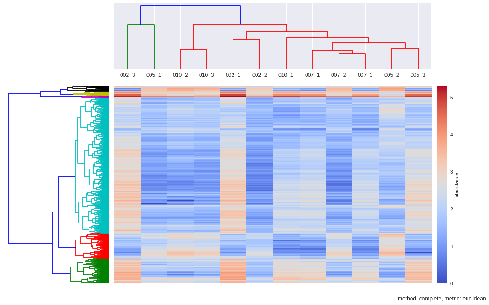


```python
#OTHER DENDROGRAM METHODS AND METRICS 

dendroRows_sin_euc, dendroCols, heatmap = hcluster(matrix, method='single', metric='euclidean', dendro_color_threshold=0.45)

```


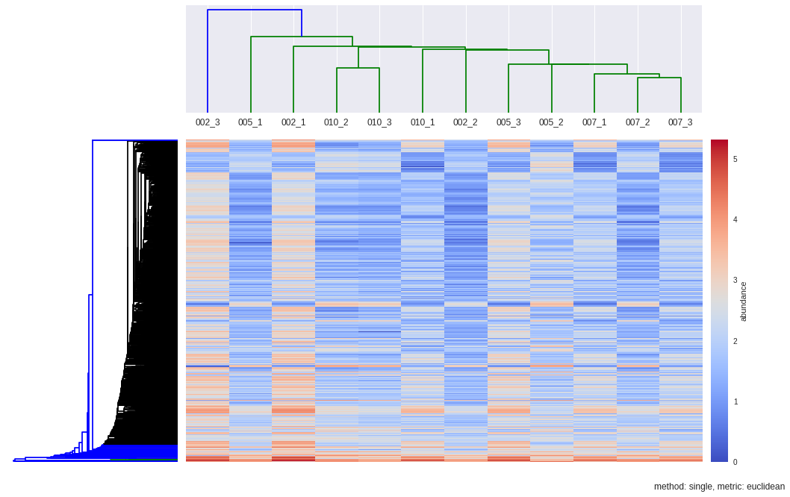


```python
dendroRows_com_cos, dendroCols, heatmap = hcluster(matrix, method='complete', metric='cosine', dendro_color_threshold=0.45)

```


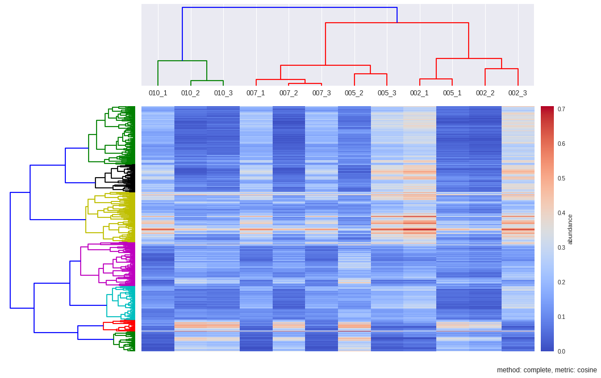


### K Means

separate samples in n groups of equal variance

first step chooses the initial centroids (k, the number of clusters)

After initialization, K-means consists of looping between the two other steps:

The first step assigns each sample to its nearest centroid.

The second step creates new centroids by taking the mean value of all of the samples assigned to each previous centroid

The inertia or within-cluster sum-of-squares is minimized


```python
#OTHER CLUSTERING METHODS BESIDES HCL: K-MEANS AND MEAN SHIFT ##############################################################
from sklearn.cluster import KMeans
from scipy.spatial.distance import pdist,cdist

#diffacto_out = "/home/vitalv/cyano/label-free-demixq-diffacto-pipeline/diffacto_out.tsv"
#diffacto = pd.read_csv(diffacto_out, delimiter="\t")
#data = diffacto[diffacto["S/N"] > -20]
#samples = ["002_1", "002_2", "002_3", "005_1", "005_2", "005_3", "007_1", "007_2", "007_3", "010_1", "010_2", "010_3"]
#data[samples] = 2 ** data[samples] #convert back to linear space, diffacto output is log2
matrix = 2**data[samples].values


#K-MEANS
# Try to find  optimal number of clusters for k-means. "Elbow" method
k_range = range(1,11)
k_means = [KMeans(n_clusters = k, init='k-means++').fit(matrix) for k in k_range]
centroids = [X.cluster_centers_ for X in k_means]
labels = [X.labels_ for X in k_means]
#calculate Euclidean distance from each point to cluster center
k_euclid = [cdist(matrix, c, 'euclidean') for c in centroids]
dist = [np.min(ke, axis=1) for ke in k_euclid]
#Total within cluster sum of squares
wcss = [sum(d**2) for d in dist]
#average wcss
avwcss = [(sum(d**2))/len(d) for d in dist]
#total sum of squares
tss = sum(pdist(matrix)**2)/matrix.shape[0]
#between cluster sum of squares:
bss = tss - wcss
#plot average wcss vs number of clusters "Elbow plot": look for a point where the rate of decrease in wcss sharply shifts
plt.plot(k_range, avwcss, '-o')
plt.ylabel("average wcss")
plt.xlabel("k")
```


    <matplotlib.text.Text at 0x7fd32a0e7510>


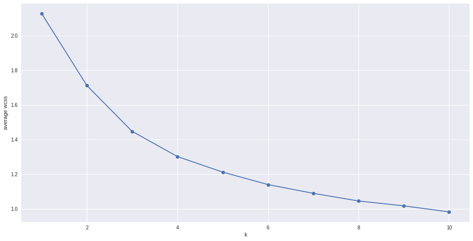


#### Silhouette plots


The silhouette plot displays a measure of how close each point in one cluster is to points in the neighboring clusters. Provides a way to assess parameters like number of clusters visually. This measure has a range of [-1, 1].

Silhouette coefficients (as these values are referred to as) near +1 indicate that the sample is far away from the neighboring clusters.

A value of 0 indicates that the sample is on or very close to the decision boundary between two neighboring clusters 

and negative values indicate that those samples might have been assigned to the wrong cluster.

The Silhouette Coefficient is calculated using the mean intra-cluster distance **(a)** and the mean nearest-cluster distance **(b)** for each sample. The Silhouette Coefficient for a sample is **(b - a) / max(a, b)**


```python
def cluster_abundance(protein_idxs, ax=None):
    protein_set = data[data["Protein"].isin(data.iloc[idxs, :].Protein)]
    X = [1,2,3,4]
    x_labels = set([c.split("_")[0] for c in samples])
    nCols = len(X)
    color_patches = []
    if not ax: fig, ax = plt.subplots()
    color=iter(plt.cm.rainbow(np.linspace(0,1,len(protein_set))))
    for i, row in protein_set.iterrows():
        Ys = row[samples].values.reshape(4,3).T #for scatter
        nRows = Ys.shape[0]
        Xs=X*nRows
        ax.plot(X, row[means].values, "-", color='gray')
    medians = protein_set[means].median(axis=0)
    ax.plot(X, medians, "-", color='red')
    ax.set_ylabel("Abundance", fontsize=9)
    ax.set_xlabel("Sample", fontsize=9)
    ax.set_title("", fontsize=10)
    ax.set_xticks(X)
    ax.set_xticklabels(sorted(list(x_labels)), fontsize=9)
```


```python
#Silhouette coefficients and cluster abundance plots ------------------------------------------------------------------------
import matplotlib.cm as cm
from sklearn.metrics import silhouette_score, silhouette_samples
range_n_clusters = range(2,7)
for n_clusters in range_n_clusters:
    fig, ax1 = plt.subplots(figsize=(16,8))
    #fig, (ax1, ax2) = plt.subplots(1, 2) # Create a subplot with 1 row and 2 columns
    ax1.set_xlim([-0.2, 1.5]) 
    ax1.set_ylim([0, len(matrix) + (n_clusters + 1) * 10]) #inserts blank space between silhouette plots of individual cluster
    # Initialize the clusterer with n_clusters value and a random generator seed of 10 for reproducibility.
    kmeans = KMeans(n_clusters=n_clusters, init='k-means++')#, random_state=10) 
    cluster_labels = kmeans.fit_predict(matrix)
    silhouette_avg = silhouette_score(matrix, cluster_labels) # The silhouette_score gives the average value for all the samples.
    print "n_clusters:", n_clusters, "Average silhouette_score is :", silhouette_avg
    sample_silhouette_values = silhouette_samples(matrix, cluster_labels) # Compute the silhouette scores for each sample
    cluster_idxs = {}
    y_lower = 10
    for i in range(n_clusters):
        c = cluster_labels == cluster
        cluster_idxs[cluster] = np.where(c == True)
        ith_cluster_silhouette_values = sample_silhouette_values[cluster_labels == i]# Aggregate silhouette scores
        ith_cluster_silhouette_values.sort() # and sort them
        size_cluster_i = ith_cluster_silhouette_values.shape[0]
        y_upper = y_lower + size_cluster_i
        color = cm.spectral(float(i) / n_clusters)
        ax1.fill_betweenx(np.arange(y_lower, y_upper), 0, ith_cluster_silhouette_values, facecolor=color, edgecolor=color, alpha=0.7)
        ax1.text(-0.05, y_lower + 0.5 * size_cluster_i, str(i+1)) # Label the silhouette plots with their cluster numbers at the middle
        y_lower = y_upper + 10  # # Compute the new y_lower for next plot 10 for the 0 samples
        position=range(n_clusters)[-(i+1)]*2+2
        ax_n = fig.add_subplot(n_clusters,2,position) #add_subplot(rows,columns,positionInGrid)
        ax_n.text(-0.05,0,str(i+1))
        idxs = list(cluster_idxs[i][0])
        cluster_abundance(idxs, ax=ax_n)
    ax1.set_xlabel("Silhouette coefficient values")
    ax1.set_ylabel("Cluster label")
    ax1.axvline(x=silhouette_avg, color="red", linestyle="--")# Vertical line for average silhouette score of all the values
    ax1.set_yticks([])  # Clear the yaxis labels / ticks
    ax1.set_xticks([-0.1, 0, 0.2, 0.4])
```

    n_clusters: 2 Average silhouette_score is : 0.185305484063
    n_clusters: 3 Average silhouette_score is : 0.195025791161
    n_clusters: 4 Average silhouette_score is : 0.178523494958
    n_clusters: 5 Average silhouette_score is : 0.158383531414
    n_clusters: 6 Average silhouette_score is : 0.14186245441


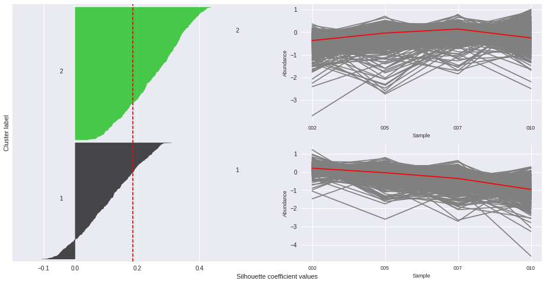


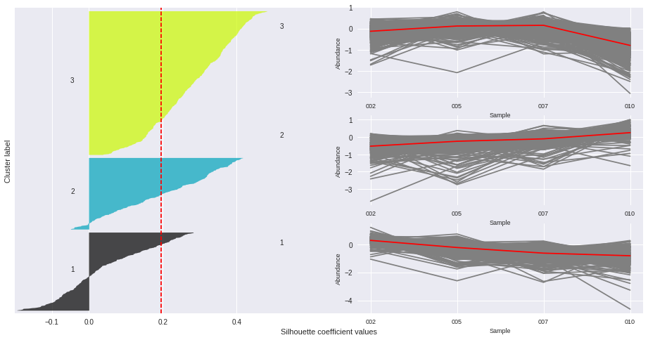


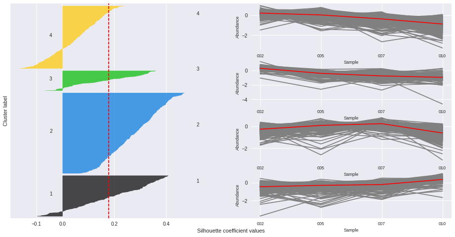


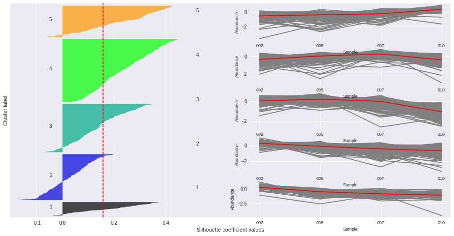


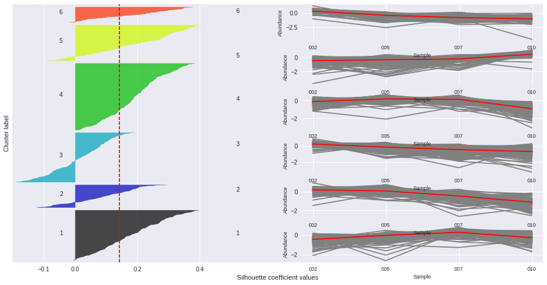


### Mean Shift

Mean shift has the advantage that it does not require a pre-defined number of clusters

Updates centroid candidates in each iteration so they become the mean of the points within a region of size determined 
by the paramater **bandwidth**

The mean shift vector is computed for each centroid and points towards a region of the maximum increase in the density of points


```python
from sklearn.cluster import MeanShift, estimate_bandwidth

bandwidth = estimate_bandwidth(matrix, quantile=0.3, n_samples=980) #default: quantile=0.3, n_samples= (all samples are used)
#quantile=0.5 means that the median of all pairwise distances is used
#but it takes a default value if bandwidth is not set

ms = MeanShift(bandwidth=bandwidth)

ms.fit(matrix)
labels = ms.labels_
cluster_centers = ms.cluster_centers_

labels_unique = np.unique(labels)
n_clusters_ = len(labels_unique)

cluster_idxs = {}
for cluster in range(n_clusters_):
    c = labels == cluster
    cluster_idxs[cluster] = np.where(c == True)

#cluster_idxs
```

**Mean shift results in very un-evenly sized clusters with one of them containing the majority of proteins**

### Dimensionality Reduction  

### PCA


```python
from sklearn.decomposition import PCA

pca = PCA().fit_transform(matrix)
ax = plt.subplot(aspect='equal')

ax.scatter(pca[:,0], pca[:,1])
 
```


    <matplotlib.collections.PathCollection at 0x7fd329fd23d0>


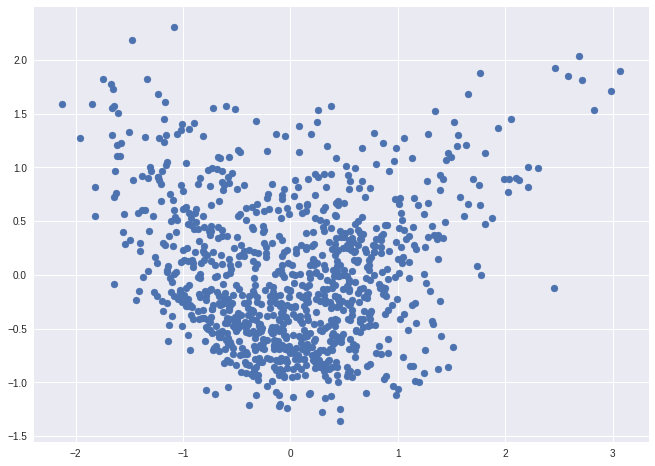


### tSNE

tSNE is a dimensionality reduction technique useful for visualizing high-dimensional data  

http://scikit-learn.org/stable/modules/generated/sklearn.manifold.TSNE.html#sklearn.manifold.TSNE  

https://www.oreilly.com/learning/an-illustrated-introduction-to-the-t-sne-algorithm  


The **learning rate** can be a critical parameter. It should be between 100 and 1000. If the cost function increases during initial optimization, the early exaggeration factor or the learning rate might be too high. If the cost function gets stuck in a bad local minimum increasing the learning rate helps sometimes  

**random_state** is Pseudo Random Number generator seed control.   
If None, use the numpy.random singleton. Note that different initializations might result in different local minima of the cost function.  


```python
from sklearn.manifold import TSNE
#defaults:
#tsne = TSNE(n_components=2, perplexity=30, learning_rate=1000, n_iter=1000) #learning_rate is also called epsilon

RS = 20150101#random_state is Pseudo Random Number generator seed control. 
#If None, use the numpy.random singleton. Note that different initializations might result in different local minima of the cost function.
#tsne = TSNE(random_state=RS).fit_transform(matrix) 

#Plot first_category_name---------------------------------------------------------------------------------
matrix = data.sort("first_category_name")[samples].values
labels = np.array(data.sort("first_category_name").first_category_name)

tsne_rs = TSNE(n_components=2, perplexity=30, learning_rate=1000, n_iter=1000, random_state=RS, verbose=1).fit_transform(matrix)
tsne_cos = TSNE(n_components=2, perplexity=30, learning_rate=1000, n_iter=1000, metric='cosine', verbose=1).fit_transform(matrix)

label_color_ = {}
for i in range(len(np.unique(labels))):
	label = np.unique(labels)[i]
	label_color_[label] = i
colors = np.array([label_color_[label] for label in labels])

def scatter(x, colors, nclasses):
	palette = np.array(sb.color_palette("hls", nclasses )) # color palette with seaborn.
	f = plt.figure(figsize=(8, 8))
	ax = plt.subplot(aspect='equal')
	sc = ax.scatter(x[:,0], x[:,1], linewidth=0, s=40, color=palette[colors.astype(np.int)])
	plt.xlim(-25, 25)
	plt.ylim(-25, 25)
	#ax.axis('off')
	ax.axis('tight')
	txts = []
	for i in range(nclasses):
		# Position of each label.
		xtext, ytext = np.median(x[colors == i, :], axis=0)
		txt = ax.text(xtext, ytext, str(i), fontsize=18)
		#txt.set_path_effects([
		#	PathEffects.Stroke(linewidth=5, foreground="w"),
		#	PathEffects.Normal()])
		txts.append(txt)
	return f, ax, sc, txts

scatter(tsne_cos, colors, len(set(colors)))
```

    [t-SNE] Computing pairwise distances...
    [t-SNE] Computing 91 nearest neighbors...
    [t-SNE] Computed conditional probabilities for sample 980 / 980
    [t-SNE] Mean sigma: 0.617742
    [t-SNE] KL divergence after 100 iterations with early exaggeration: 1.077683
    [t-SNE] Error after 200 iterations: 1.077683
    [t-SNE] Computing pairwise distances...
    [t-SNE] Computing 91 nearest neighbors...
    [t-SNE] Computed conditional probabilities for sample 980 / 980
    [t-SNE] Mean sigma: 0.197319
    [t-SNE] KL divergence after 100 iterations with early exaggeration: 1.119585
    [t-SNE] Error after 175 iterations: 1.119585


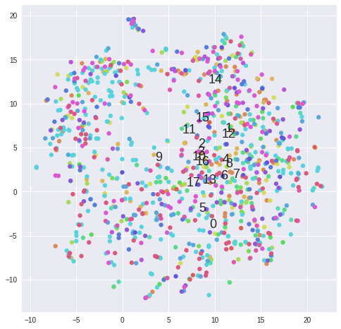


```python
#Plot clusters from k-means ------------------------------------------------------------------------------------------------
matrix =  2**data[samples].values
for k in range(2,5):
	kmeans = KMeans(n_clusters=5, init='k-means++')#, random_state=10) 
	cluster_labels = kmeans.fit_predict(matrix)
	tsne = TSNE(n_components=2, perplexity=30, learning_rate=1000, n_iter=1000, metric='cosine', verbose=0).fit_transform(matrix)
	scatter(tsne, cluster_labels, len(set(cluster_labels)))
```


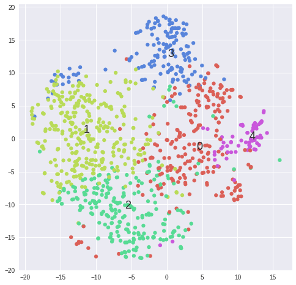


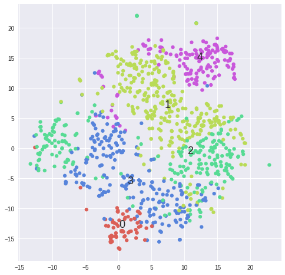


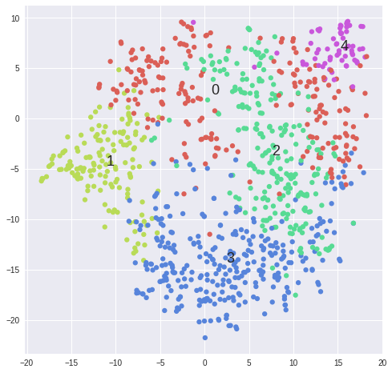

