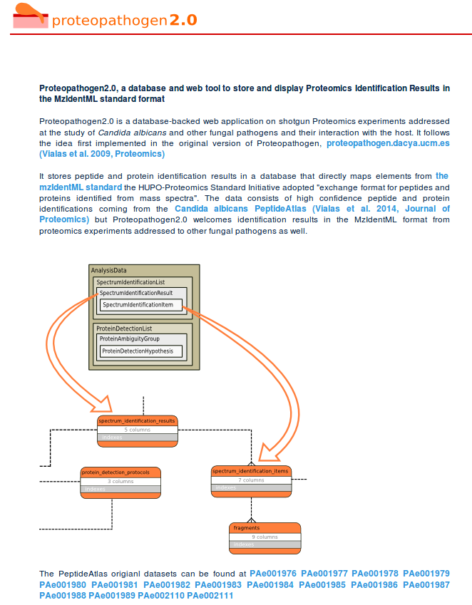

The <a href="http://proteopathogen2.cnb.csic.es" target="_blank">Proteopathogen</a> database was a large part of my thesis. It's a <i>Ruby on Rails</i> web app, to store and visualize proteomics datasets.
The results from Mass Spectrometry experiments are usually stored in quite large XML files. Associated to Proteopathogen I also
wrote a parser to extract the information from MzIdentML (The XML files containing the list of identified peptides and proteins and all 
the corresponding information) and scripts to insert the data into the database. 

I'm particularly proud of this project because I did everything from scratch. Designing the <i>MySQL</i> database to accomodate this type of complex
data was quite challenging but also rewarding. Then I also had quite a lot of fun creating the front. Its mostly haml/sass sprinkled with some
jquery like the <i>datatables</i> library and also <i>D3</i> to visualize mass spectra.

